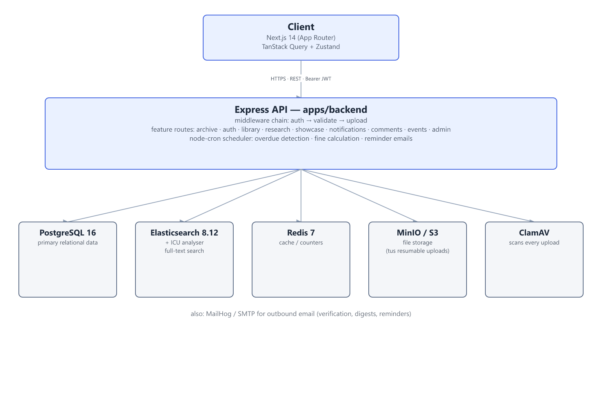
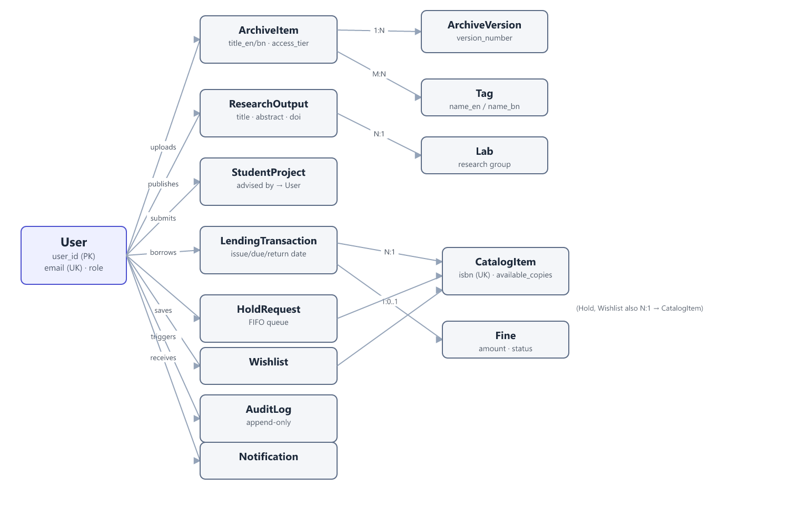

# CSE 4113 – Internet Programming Lab
## Project Report

**Project Name:** Digital Knowledge Platform (DKP)
**Team Name:** Semicolon Squad

| Team Member | Student ID |
|---|---|
| Faria Yasmin | [student ID] |
| Hasibul Islam Sifat | 2021211218 |
| Md. Nuruzzaman | 2021611232 |
| Yuki Bhuiyan | 2021816226 |

**28th Batch**
Department of Computer Science & Engineering
University of Dhaka

**Submitted to:** Md. Fahim Arefin, Lecturer, Department of Computer Science & Engineering, University of Dhaka
**Submitted on:** [date]

---

## Project Links

| Item | URL |
|---|---|
| Public Git Repository | https://github.com/Semicolon-Squad-DU/Digital_Knowledge_platform |
| Deployed Application URL | https://semicolon.farefin.com/ |
| API Docs (Swagger/Postman) | [add link] |
| Demo Video | [add link] |

---

## 1. Introduction

### 1.1 Problem Definition & Context

Most Bangladeshi universities and research labs end up managing their academic assets in a very ad-hoc way: archived documents and scanned records sit in whatever folder someone happened to save them in, research papers are emailed around instead of catalogued anywhere, student projects vanish into a random Google Drive the moment the semester ends, and the physical library still runs on paper registers and spreadsheets. None of these systems talk to each other, none of them are searchable in any real sense, and none of them support Bangla — which shuts out a large part of the people who'd actually want to use them.

The result is what you'd expect: people redo work because they can't find what already exists, institutional knowledge disappears every time a batch of students graduates, librarians spend their time on manual bookkeeping instead of helping people, and access to sensitive material is either locked down too hard or not locked down at all because there's no proper tiering.

DKP is our attempt to fix this by putting all of it — archive, research repository, library catalog, and student showcase — behind one platform with real search, real access control, and real version history.

### 1.2 Target Users & Use Cases

| User Group | What they need from DKP |
|---|---|
| Public Visitors | Browse the public catalog, read published research, look through the showcase |
| Students | Search and download resources, borrow books, submit their own projects |
| Researchers / Faculty | Upload research outputs, manage a lab page |
| Library Members | Borrow/return books, keep a wishlist, place holds, see their own history |
| Staff / Archivists | Upload and organise documents, manage access tiers, do bulk operations |
| Librarians | Full catalog CRUD, handle lending/returns, chase overdues and fines, pull reports |
| System Administrators | Manage users and roles, read audit logs |

A few flows that show how these pieces fit together: an archivist uploads a scanned document, which sits as a Draft until it's reviewed and Published and becomes searchable; a member walks up to the librarian's desk, the librarian looks up the book and the member by ID, and the system records the loan and due date; and a student submits a final-year project, which stays hidden until their advisor approves it, at which point it shows up in the public showcase gallery.

### 1.3 Core Features

- **Digital Archive** — file upload, bilingual metadata, four access tiers, version history, full-text search
- **Library Management** — catalog, issue/return workflow, fines, hold requests, wishlist
- **Research Repository** — output records, citation export (BibTeX/APA/MLA), lab pages
- **Student Project Showcase** — submission, advisor review, public gallery
- **Community Features** — threaded comments, reactions, events & seminars with RSVP
- **Notifications** — in-app feed (refreshed by polling — see 2.2 for why we didn't reach for WebSockets)
- **Admin & Security** — role-based access, audit logging, JWT auth, rate limiting

### 1.4 Tech Stack Overview

| Layer | Choice | Why we picked it |
|---|---|---|
| Frontend | Next.js 14 (App Router) + TypeScript | Server rendering on the public search/catalog pages helps both load time and SEO |
| Styling | Tailwind CSS | Fast to iterate with across a 4-person team |
| Server state | TanStack Query v5 | Handles caching and refetching for us instead of us hand-rolling it |
| Client/UI state | Zustand | Much less boilerplate than Redux for the amount of local state we actually needed |
| Forms | React Hook Form + Zod | Same Zod schema validates the form on the client and the request on the server |
| Backend | Node.js + Express + TypeScript | The team already knew this stack well, so we could move fast |
| Primary DB | PostgreSQL 16 | Relational integrity mattered for users, transactions, and fines |
| Search | Elasticsearch 8.12 (ICU plugin) | Best Bangla tokenisation support we could find, alongside English full-text |
| Object storage | MinIO (S3-compatible) | Lets us swap between self-hosted storage and AWS S3 later without touching code |
| Cache | Redis 7 | Session and notification-counter caching |
| Auth | JWT (access + refresh) + Google OAuth | Stateless and simple for a decoupled frontend; see 4.1 for how the Google side works |
| File upload | tus protocol | Resumable chunked uploads, since documents can be up to 500 MB |
| Antivirus | ClamAV | Every uploaded file gets scanned before it's trusted |
| Email | Nodemailer + MailHog (dev) | MailHog gives us a fake inbox locally so we're not spamming real addresses while testing |

We also lean on Google OAuth (verifying tokens server-side, no client secret needed), MinIO/S3 for storage, and — just for team development, not production — a shared Supabase Postgres instance so everyone on the team sees the same data locally.

---

## 2. System Architecture

### 2.1 High-Level Architecture Diagram



The frontend never talks to Postgres, Elasticsearch, Redis, or storage directly — everything goes through the Express API over REST, authenticated with a bearer JWT. The API is the only thing that touches the data layer, which keeps the access-tier and RBAC checks (see Section 4) in one place instead of scattered across the client.

### 2.2 Frontend Architecture

**Routing.** We used the Next.js App Router, with one route segment per module: `archive/`, `library/`, `research/`, `showcase/`, `events/`, `dashboard/`, `admin/`, `librarian/`, `profile/[id]`, `notifications/`, `search/`, plus the usual `login`/`register`/`forgot-password`.

**Components.** Domain-specific logic (hooks + components) lives under `src/features/<domain>/` for archive, library, research, showcase, and notifications. Shared building blocks — buttons, inputs, cards, the navbar — live in `src/components/ui/` and `src/components/layout/` so they don't get duplicated per feature.

**State management.** We split this deliberately into two layers instead of using one library for everything: **TanStack Query** owns anything that comes from the server (fetching, caching, invalidation), and **Zustand** owns purely client-side UI state like the logged-in session. Mixing these two concerns into one store is a common source of bugs, so we kept them apart from the start.

**How the UI stays up to date.** We don't use WebSockets or server-sent events anywhere in DKP. The notification feed and dashboards update by having TanStack Query poll and refetch on window focus. It's a simpler approach than building a push channel, and for a project on our timeline it was the right trade-off — the cost is that updates land on the next poll rather than instantly, which is fine for due-date reminders and announcements but worth knowing about if you're expecting true real-time behaviour.

### 2.3 Backend Architecture

We organised the backend by feature rather than by technical layer:

```
src/
├── core/
│   ├── config/           env/config loading, logger
│   ├── db/                pool, init.sql, migrations/ (29 files so far), seed.ts
│   ├── middleware/        auth · audit · error · upload · validate
│   └── utils/
├── features/
│   └── archive/  auth/  library/  notifications/  research/  showcase/
├── infrastructure/
│   ├── s3.service.ts · elasticsearch.service.ts · email.service.ts
│   ├── google-auth.service.ts · antivirus.service.ts · backup.service.ts
│   └── cache.service.ts · tus.service.ts · notification.service.ts
├── jobs/
│   └── scheduler.ts       node-cron: overdue detection, fine calc, reminders
└── server.ts
```

Every request goes through a middleware chain — `auth` → `validate` (Zod / express-validator) → `upload` where relevant — before it reaches a feature route. Anything that talks to the outside world (S3, Elasticsearch, email, the antivirus scanner) is tucked behind a service module in `infrastructure/`, and state-changing actions get written to an append-only audit log by `audit.middleware`.

This paid off directly in testing: because every external dependency sits behind its own service, our backend unit tests can mock `core/db/pool` and run without touching a real database at all, while a separate integration suite runs the same routes against an actual Postgres instance in CI.

### 2.4 Database Design

We started with 14 core entities in our initial design, and the schema has grown since through 29 incremental migrations — adding community/events tables, per-item access tiers on the library catalog, notification preferences, and backup/replication tracking as we went.



*(Comments, reactions, events, event materials/RSVPs, announcements, and access requests were added later by migration and aren't shown above to keep the diagram readable — they hang off `User` the same way everything else does.)*

**Normalisation & indexes.** Everything is in third normal form — no repeating groups, and foreign keys everywhere a relationship exists (`LendingTransaction.catalog_id → CatalogItem`, `ArchiveVersion.item_id → ArchiveItem`, etc.). `email` on `User` and `isbn` on `CatalogItem` are unique. Foreign key columns and the columns we filter/sort on most in search and dashboards (`access_tier`, `status`, `due_date`) are indexed.

**How updates reach the UI.** As mentioned in 2.2, there's no live push from the database to the browser — the frontend just re-fetches through TanStack Query. So when we say a dashboard "updates in real time," we mean on the next poll or refocus, not the instant a row changes in Postgres. We considered WebSockets for this but decided it wasn't worth the added complexity for what the notification feed actually needs.

---

## 3. API Documentation

### 3.1 API Design Overview

A REST API over HTTPS, JSON bodies throughout, everything under `/api`. We haven't added a version prefix (no `/v1/`) — something we'd revisit if this API needed to keep evolving after the course ends. Auth is a bearer JWT in the `Authorization` header.

### 3.2 Endpoint Reference

| Module | Base Path | Key Endpoints | Auth Required |
|---|---|---|---|
| Auth | `/api/auth` | `POST /register`, `POST /login`, `POST /refresh`, `POST /logout`, `GET /me` | Mixed |
| Archive | `/api/archive` | `GET /search`, `POST /upload`, `POST /bulk-upload`, `GET /:id`, `GET /:id/download`, `PATCH /:id/status`, `GET /:id/versions`, `POST /:id/access-request`, `GET /tags` | Mixed by access tier |
| Library | `/api/library` | `GET /catalog`, `POST /catalog`, `POST /issue`, `POST /return`, `GET /holds`, `GET /wishlist`, `GET /fines`, `GET /dashboard`, `GET /member/:id/history` | Mixed |
| Research | `/api/research` | `GET /`, `POST /`, `GET /:id`, `PUT /:id`, `DELETE /:id`, `GET /:id/cite`, `GET /labs`, `POST /labs` | Mixed |
| Showcase | `/api/showcase` | `GET /gallery`, `POST /submit`, `GET /:id`, `POST /:id/review`, `GET /pending` | Mixed |
| Notifications | `/api/notifications` | `GET /`, `PATCH /:id/read`, `GET /announcements` | Yes |
| Comments | `/api/comments` | `GET /:entityType/:entityId`, `POST /`, `DELETE /:id` | Mixed |
| Reactions | `/api/reactions` | `POST /`, `DELETE /`, `GET /:entityType/:entityId` | Mixed |
| Events | `/api/events` | `GET /`, `POST /`, `GET /:id`, `POST /:id/rsvp`, `DELETE /:id/rsvp` | Mixed |
| Admin | `/api/admin` | user management, role assignment | Admin only |

Health check: `GET /health`, also polled by our Docker health checks (see 6.5).

### 3.3 Swagger / Postman Collection Link

[add link] — we haven't generated one yet. Since we already write Zod schemas for validation on most routes, the plan is to derive an OpenAPI spec from those with `zod-to-openapi` rather than writing docs by hand twice.

### 3.4 Sample Request & Response

```
POST /api/auth/login
Content-Type: application/json

{
  "email": "student@dkp.edu.bd",
  "password": "Test@123456"
}
```

```
200 OK
{
  "accessToken": "eyJhbGciOiJIUzI1NiIs...",   // 15-minute expiry
  "refreshToken": "eyJhbGciOiJIUzI1NiIs...",  // 7-day expiry
  "user": {
    "id": "a1b2c3d4-...",
    "email": "student@dkp.edu.bd",
    "role": "member"
  }
}
```

---

## 4. Authentication & Security

### 4.1 Authentication Strategy

We use JWTs — short-lived access tokens (15 minutes) and longer-lived refresh tokens (7 days), signed with HS256, with a 30-minute inactivity timeout on top. We went with JWT over server-side sessions because it's stateless and pairs naturally with a decoupled Next.js frontend.

Google Sign-In is also supported, and deliberately without a client secret: the backend verifies the Google access token directly against Google's `tokeninfo`/`userinfo` endpoints rather than doing an authorization-code exchange, so only a Client ID needs configuring on either side. Institutional SSO (LDAP) was on our original wishlist but we didn't get to it.

### 4.2 Authorization & Role Management

Seven roles — Guest, Member, Student Author, Researcher, Archivist/Staff, Librarian, Admin — enforced at two points: the API middleware checks the JWT's role before a request reaches its handler, and the same access-tier check happens again at the query level, so a Member can't pull a Staff-tier archive item even if they somehow got hold of its ID.

### 4.3 Security Measures

| Concern | What we did |
|---|---|
| Passwords | Hashed with bcryptjs, never stored or logged in plaintext |
| Input validation | Zod schemas + express-validator across the archive/library/research/showcase routes |
| HTTP hardening | Helmet + express-rate-limit |
| File uploads | MIME-type and size checks, plus a ClamAV scan on every upload before it's trusted |
| Data at rest | Files are written with server-side encryption (AES256) |
| Secrets | Everything (JWT secret, DB password, storage keys, Google Client ID) comes from environment variables, never hardcoded, and `.env` is git-ignored |
| Demo credentials | The `Test@123456` password in our README is seed data for local development only, not a production credential |

### 4.4 Known Vulnerabilities & Mitigations

Being upfront about the gaps rather than pretending they don't exist:

- **Access-tier bugs are our biggest realistic risk.** It's the kind of mistake that's easy to introduce in a new route and easy to miss in review. We check it at two layers (4.2), but we don't yet have a dedicated test matrix covering every role against every access tier, which we'd want before trusting this with anything genuinely sensitive.
- We don't have automated dependency scanning in CI (no `npm audit`/Dependabot step yet) — worth adding given how much the backend leans on third-party packages for auth, file handling, and S3.
- No explicit CSRF protection, though the risk is low since the API is bearer-token-based rather than cookie-session-based.
- Bangla search relevance is more of a data-quality risk than a security one, but it's still an open item — full-text Bangla tokenisation isn't finished yet (see 8.3).

---

## 5. Testing & Quality Assurance

### 5.1 Testing Strategy

| Layer | Tool | Notes |
|---|---|---|
| Backend unit | Jest (ts-jest) | 22 test files; the database is mocked, so these run without Postgres |
| Backend integration | Jest (separate config) | 7 test files, run against a real Postgres 16 instance in CI |
| Frontend unit | Vitest + Testing Library | 10 test files |
| End-to-end | Playwright | 3 specs: homepage smoke test, archive visibility, public catalog search |

### 5.2 Test Coverage Summary

| Suite | Current coverage | Our target |
|---|---|---|
| Backend | ~18% statements | 70% |
| Frontend | ~5.5% statements | 70% |

We're honestly still a long way from our own target here. Rather than leave the CI coverage gate meaningless (either always failing or quietly ignored), we set the enforced floor to roughly where we actually are today, so it still catches regressions while we keep raising it sprint over sprint. It's an interim measure, not the finish line — see 8.3.

### 5.3 Bug Tracking & Resolution Log

[Link your GitHub Issues/Projects board here if you're using one.] A few examples of bugs we ran into and fixed along the way, straight from our commit history:

- Secure file downloads and access validation needed a second pass after we found gaps in how download links checked access tier
- Access-tier and loan-status indicators in the UI were showing stale state after a status change
- Page 2+ of the showcase gallery was missing thumbnails because those projects had a `thumbnail_url` set that the earlier pages didn't need to handle
- A production bug where PDF previews stopped loading — see 8.2, this one taught us the most

### 5.4 Sample Test Cases

| Test ID | Scenario | Expected Result |
|---|---|---|
| TC-001 | Archivist uploads a valid PDF, fills metadata, saves as Draft | File uploaded, metadata saved, status = Draft |
| TC-002 | Member attempts to open a Restricted-tier item | "Access Denied", no file served |
| TC-003 | Librarian issues a book (manual ID entry) | Transaction recorded, available copies decrease by 1 |
| TC-004 | Librarian processes a 3-day-overdue return (Tk 5/day) | Return processed, Tk 15 fine added |
| TC-005 | New user signs up via Google OAuth | Profile created, JWT issued, role = Member |

---

## 6. CI/CD & Deployment

### 6.1 Pipeline Overview

GitHub Actions runs on every push/PR, with four jobs:

1. **Block bot commits** — since this is an assessed academic project, we reject any push authored by a bot account before anything else runs.
2. **Backend** — lint → coverage-gated tests → build → a check that `seed.ts` hasn't been accidentally emptied.
3. **Backend integration** — spins up a real Postgres container, applies the base schema plus every migration in order, then runs the integration suite against it. (We used to only apply the base schema here, which meant CI could pass on a database missing whatever the newest migration added — we fixed that by replaying every migration file in order, same as a real install would.)
4. **Frontend** — lint → coverage-gated tests → build.

### 6.2 Environments

| Environment | Setup |
|---|---|
| Local development | Docker Compose (Postgres, Elasticsearch, MinIO, Redis, MailHog, ClamAV) + `npm run dev:full` |
| Team development | A shared Supabase Postgres instance so everyone on the team sees the same data, while search/cache/storage stay local |
| CI | A disposable Postgres container per run, isolated test database |
| Production | Docker Compose with a production override file, fully driven by environment variables |

### 6.3 Deployment Steps

1. Copy `.env.example` to `.env` and fill in real values — never commit the filled-in file.
2. Set up Google Sign-In: add the real deploy domain to Authorized JavaScript origins, and use the same Client ID on both frontend and backend.
3. `docker compose -f docker-compose.yml -f docker-compose.prod.yml up --build -d`
4. Check `curl https://<domain>/api/health` (or the equivalent on your setup).
5. One thing that caught us out: frontend env vars starting with `NEXT_PUBLIC_` get baked into the JS bundle at build time, not read at container start — so changing one later means rebuilding the frontend image, not just restarting it.

### 6.4 Hosting Platform & Live URL

Live at **https://semicolon.farefin.com/** — self-hosted with Docker Compose rather than a managed platform. As of writing, browsing and login work but file previews/downloads are broken in production; see 8.2 for what's going on and 8.3 for where that stands.

### 6.5 Monitoring & Logging

We have Winston structured logging and a `/health` endpoint that our Docker health checks poll. We don't have Prometheus/Grafana set up yet, which was on our original plan but didn't make it in — logging is enough to debug things by hand for now, but it's not real monitoring.

---

## 7. Repository & Documentation Quality

### 7.1 Branching Strategy & Commit Conventions

We've worked out of a single branch (`main2`) for most of the project, tagging `sprint1-complete` as a milestone marker. `CODEOWNERS` requires sign-off from the team on core backend routes and the whole frontend, and (paired with the CI bot-block above) bot accounts can't approve or push directly, since this needs to be our own work.

Our commit messages are a mix of Conventional Commits (`feat:`, `fix:`, `refactor:`) for anything structural, and shorter descriptive ones for quick iteration. Something we'd tighten up if we did this again.

### 7.2 README Completeness Checklist

- [x] Features overview
- [x] Tech stack
- [ ] Screenshots — placeholder only, still need to add these (see Appendix)
- [x] Installation / setup steps
- [x] Environment variables
- [x] Run / test commands
- [x] API endpoints
- [ ] Folder structure — out of date, still shows our old layout before we moved to `core/ + features/ + infrastructure/`
- [ ] License file — README references one under MIT but we never actually added the file

### 7.3 Code Organization / Folder Structure

See 2.3 for the backend layout and 2.2 for the frontend. The 29 migration files under `apps/backend/src/core/db/migrations/` are a decent record of how much the schema grew past our original design — things like `access_tier` on the catalog, notification preferences, and backup/replication tracking all came in after the fact as we discovered we needed them.

### 7.4 Local Setup Instructions

```bash
git clone https://github.com/Semicolon-Squad-DU/Digital_Knowledge_platform.git
cd Digital_Knowledge_platform
npm install
npm run docker:up                 # Postgres, Elasticsearch, MinIO, Redis, MailHog, ClamAV
cd apps/backend && cp .env.example .env
npm run db:migrate
npm run db:seed                   # optional: demo users + sample data
cd ../.. && npm run dev:full      # backend :4000, frontend :3000
```

Demo accounts (password `Test@123456` for all): `admin@dkp.edu.bd`, `librarian@dkp.edu.bd`, `researcher@dkp.edu.bd`, `student@dkp.edu.bd`.

---

## 8. Evaluation & Reflection

### 8.1 Web Performance & Core Web Vitals

[Run Chrome Lighthouse or PageSpeed Insights against the homepage and archive search page, and drop the FCP/LCP/TBT numbers in here.] We haven't measured this yet. What we do have going for us already: server-side rendering on the public pages, a Tailwind build step that produces one purged CSS file, and chunked uploads so a large file doesn't block the page.

### 8.2 Challenges & Solutions

| Challenge | How we solved it |
|---|---|
| MinIO rejected our uploads with "KMS not configured for a server side encrypted objects" once we started sending an encryption header on every upload | Configured a static KMS key in Compose so MinIO would honour it |
| ClamAV takes a few minutes to download virus definitions on first boot, which was failing our health check before it finished | Gave the health check a much longer grace period before it starts failing the container |
| Our CI integration tests were only applying the base schema, not the newer migrations, so tests could pass in CI against a database that didn't match what was actually running anywhere else | Made CI replay every migration file in order, the same way a real install would |
| The shared Supabase `users` table has a bunch of extra internal columns from Supabase Auth that our own schema doesn't define | We already name every column explicitly instead of `SELECT *`, so this turned out to be a non-issue once we understood it |
| Two different branches independently created migration files numbered the same way, and we didn't catch it until merging | We're more careful now about claiming a migration number before starting on a schema change |
| **The big one:** PDF previews and downloads stopped working on the live deployment | Traced it to our production Compose file pointing file storage at an internal Docker hostname that only our own containers can reach — it worked server-to-server, but any link we handed back to a real browser was unreachable. A second bug made this harder to find: our code was quietly treating "can't reach storage" the same as "file doesn't exist," so the error message pointed us the wrong way for a while. Both are fixed in code now; redeploying with the right storage endpoint is the last step. |

### 8.3 Limitations & Future Work

- Test coverage is well below where we want it — ~18% backend, ~5.5% frontend against a 70% goal.
- File previews/downloads are broken on the live deployment as of this report; the fix is written but not yet redeployed.
- No generated API docs (Swagger/Postman) yet.
- No real monitoring beyond logs and a health check.
- A few features from our original plan didn't make the cut for this version: full Bangla full-text search (metadata search in Bangla works, full-text doesn't yet), barcode/QR scanning for lending (we do it by manual ID entry instead), the hold-request queue, and CSV catalog import.
- Our README's folder structure diagram and license section need updating — quick fixes, just haven't gotten to them.

### 8.4 Lessons Learned

- Writing a precise, testable requirement is genuinely harder than writing the code for it — most of our implementation bugs traced back to something we'd been vague about in the SRS.
- Prioritising with MoSCoW was what made a 9-module scope survive a 14-week timeline — Archive and Library came first, everything else followed once those were solid.
- Designing for Bangla from day one (collation, tokenisation, bilingual fields) turned out to be a very different exercise than adding it later would have been — glad we didn't try to bolt it on at the end.
- Setting our CI coverage gate to where we actually are, instead of where we want to be, was a small decision that mattered more than expected — it keeps the check honest instead of either always red or quietly ignored.
- The production storage bug (8.2) taught us to be more careful about config values that get used for two different things (a server talking to storage vs. a browser needing to reach the same storage) — those need to be two separate settings, not one.

### 8.5 Individual Responsibility

| Member | Core Responsibilities | Key PRs / Commits | Estimated % Contribution |
|---|---|---|---|
| Yuki Bhuiyan | Backend feature routes (archive/auth/library/research), S3 service, cron scheduler | [link PRs] | ~37% |
| Faria Yasmin | Frontend features and pages | [link PRs] | ~30% |
| Hasibul Islam Sifat | Backend feature routes, seed data | [link PRs] | ~29% |
| Md. Nuruzzaman | Backend feature routes, SRS/SDD authoring | [link PRs] | ~3–4% |

These percentages are rough, based on commit counts, and don't fully capture design discussions, code review, or the requirements/design docs — adjust before submitting if they don't reflect how the work actually split.

---

## Appendix — Screenshots / UI Walkthrough

*Screenshots to add once file storage is fixed on the deployed site: public archive search, archive item detail with the PDF viewer, showcase gallery, library catalog search, member dashboard, librarian dashboard, archivist bulk-upload screen, research output detail, notification feed, user profile, and the event calendar.*
